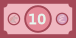
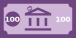

# Play Money

Vector images in SVG format for play money. 

No currency symbols or names are used to make the money universally applicable. 

The images were created in [Inkscape](https://inkscape.org) as an accompaniment to the [Ten Dollar Adventure](https://tendollaradventure.com) children's book, and associated [financial literacy lesson plans](https://tendollaradventure.com/printables/) for children in the K-5 grade segment (~ 6-11 years old). 

## Denominations

+ 1
<picture>

</picture>

<picture>

</picture>

+ 5
<picture>

</picture>

<picture>

</picture>

+ 10
<picture>

</picture>

<picture>

</picture>

+ 20
<picture>

</picture>

<picture>

</picture>

+ 100
<picture>

</picture>

<picture>

</picture>

## Formats

+ _bill vectors are individual notes in 2:1 aspect ratio:  _f (front) and _b (back) designs
+ _sheet sheets contain 10 notes in US Letter document size: 8.5 x 11 in. 
+ sheets available as printable two-page PDFs for two-sided printing

## License

Play Money is marked with [CC0 1.0 Universal](https://creativecommons.org/publicdomain/zero/1.0/?ref=chooser-v1)
